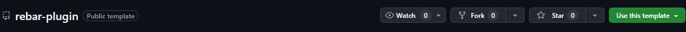

# Rebar TS Plugin Template

The [Rebar TS Plugin Template](https://github.com/richman-gaming-de/rebar-plugin) is a TypeScript template for a [Rebar](https://rebarv.com/) Plugin.

As we create a separate GitHub repository for each new plugin, we select this template directly there. We recommend this procedure to anyone who does not want to create their plugin by hand every time. Alternatively, nothing speaks against a simple download and subsequent use of the template.

## Use of a third-party template

1. Open [the template](https://github.com/richman-gaming-de/rebar-plugin) in your preferred browser
2. Click on Use this Template

